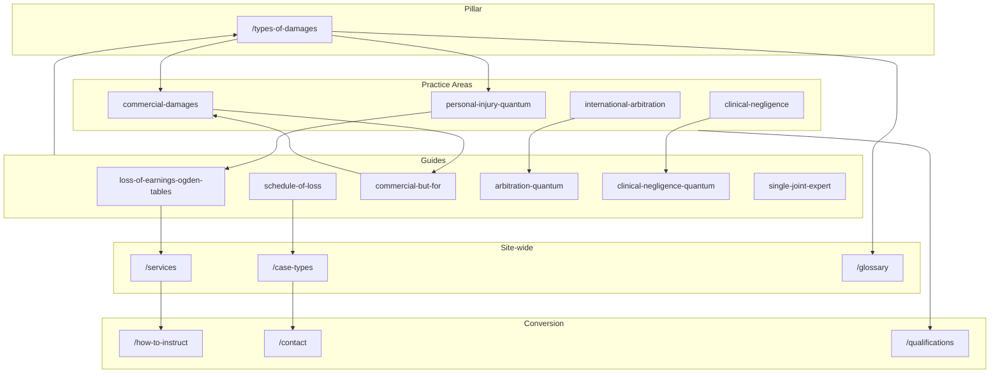
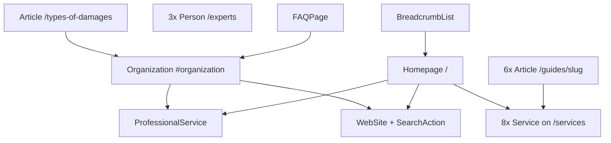

# SEO Architecture  -  damagesexpertwitness.co.uk

**Site:** https://www.damagesexpertwitness.co.uk  
**Audience:** UK solicitors, barristers, law firms, and international arbitration counsel instructing damages expert witnesses  
**Primary KPI:** Rank for Tier 1 transactional terms (e.g. *damages expert witness UK*, *quantum expert witness UK*, *loss of earnings expert witness UK*)  
**Last updated:** May 2026

This document is the canonical SEO blueprint for DamagesExpertWitness.co.uk. It governs keyword targeting, content clusters, internal linking, structured data, GEO (generative engine optimization), off-page activity, competitor monitoring, the `.co.uk` domain strategy, and deployment.

**Structural differentiator:** `/practice-areas` separates PI, clinical negligence, commercial litigation, and international arbitration into dedicated audience hubs  -  a structure no competitor in the monitoring set currently uses. This is the primary IA and internal-linking advantage.

---

## Table of contents

1. [Keyword strategy](#1-keyword-strategy)
2. [Content cluster map](#2-content-cluster-map)
3. [Internal linking rules](#3-internal-linking-rules)
4. [Schema architecture](#4-schema-architecture)
5. [GEO optimization targets](#5-geo-optimization-targets)
6. [Off-page SEO targets](#6-off-page-seo-targets)
7. [Competitor monitoring](#7-competitor-monitoring)
8. [.co.uk domain note](#8-couk-domain-note)
9. [Deployment checklist](#9-deployment-checklist)
- [Sitemap & robots generation](#sitemap--robots-generation)
- [Appendix A: Full route inventory](#appendix-a-full-route-inventory)
- [Appendix B: Sitemap priorities](#appendix-b-sitemap-priorities)
- [Appendix C: Title and meta templates](#appendix-c-title-and-meta-templates)
- [Appendix D: Implementation status](#appendix-d-implementation-status)

---

## 1. Keyword strategy

### Tier 1  -  Transactional

| Keyword |
|---------|
| damages expert witness UK |
| damages expert witness .co.uk |
| quantum expert witness UK |
| loss of earnings expert witness UK |
| damages expert witness personal injury |
| commercial damages expert witness UK |
| clinical negligence quantum expert |
| damages expert witness arbitration |
| forensic accountant damages expert UK |
| special damages expert witness UK |

### Tier 2  -  Informational

| Keyword |
|---------|
| what are general damages UK law |
| what are special damages UK law |
| how are Ogden Tables used |
| what is the discount rate damages UK |
| types of damages UK litigation |
| how is loss of earnings calculated UK |
| what is a Schedule of Loss |
| clinical negligence quantum explained |
| but-for test commercial damages UK |
| international arbitration quantum expert |

### Tier 3  -  Long-tail / case type

| Keyword |
|---------|
| loss of earnings personal injury expert witness UK |
| pension loss calculation expert witness |
| future care costs expert witness UK |
| clinical negligence schedule of loss |
| IP infringement damages expert UK |
| investment treaty damages expert |
| employment discrimination loss expert witness |
| fatal accident dependency expert witness |
| Ogden Tables multiplier expert UK |
| discount rate personal injury UK |

### Keyword → URL mapping

| Keyword cluster | Primary URL | Secondary URLs |
|-----------------|-------------|----------------|
| damages expert witness UK / .co.uk | `/` | `/what-is-a-damages-expert-witness`, `/services` |
| quantum expert witness UK | `/` | `/practice-areas`, `/qualifications` |
| loss of earnings expert witness UK | `/case-types/loss-of-earnings-personal-injury` | `/guides/loss-of-earnings-ogden-tables-guide`, `/services#loss-of-earnings` |
| damages expert witness personal injury | `/practice-areas/personal-injury-quantum` | `/case-types/loss-of-earnings-personal-injury`, `/types-of-damages` |
| commercial damages expert witness UK | `/practice-areas/commercial-damages` | `/case-types/commercial-contract-damages`, `/guides/commercial-damages-but-for-guide` |
| clinical negligence quantum expert | `/practice-areas/clinical-negligence` | `/guides/clinical-negligence-quantum-guide`, `/case-types/clinical-negligence-quantum` |
| damages expert witness arbitration | `/practice-areas/international-arbitration` | `/guides/international-arbitration-quantum`, `/case-types/investment-treaty-damages` |
| forensic accountant damages expert UK | `/qualifications` | `/experts`, `/services` |
| special damages expert witness UK | `/types-of-damages` | `/glossary#special-damages`, `/faq` |
| what are general damages UK law | `/types-of-damages` | `/glossary#general-damages` |
| what are special damages UK law | `/types-of-damages` | `/glossary#special-damages` |
| how are Ogden Tables used | `/guides/loss-of-earnings-ogden-tables-guide` | `/glossary#ogden-tables`, `/case-types/loss-of-earnings-personal-injury` |
| what is the discount rate damages UK | `/types-of-damages` | `/glossary#discount-rate`, `/faq` |
| types of damages UK litigation | `/types-of-damages` | `/what-is-a-damages-expert-witness` |
| how is loss of earnings calculated UK | `/case-types/loss-of-earnings-personal-injury` | `/guides/loss-of-earnings-ogden-tables-guide` |
| what is a Schedule of Loss | `/guides/schedule-of-loss-expert-evidence` | `/glossary#schedule-of-loss` |
| clinical negligence quantum explained | `/guides/clinical-negligence-quantum-guide` | `/practice-areas/clinical-negligence` |
| but-for test commercial damages UK | `/guides/commercial-damages-but-for-guide` | `/glossary#but-for-analysis`, `/practice-areas/commercial-damages` |
| international arbitration quantum expert | `/practice-areas/international-arbitration` | `/guides/international-arbitration-quantum` |
| pension loss calculation expert witness | `/case-types/pension-loss-calculation` | `/services#pension-loss` |
| future care costs expert witness UK | `/case-types/future-care-costs` | `/services#future-care-costs`, `/practice-areas/clinical-negligence` |
| clinical negligence schedule of loss | `/guides/schedule-of-loss-expert-evidence` | `/case-types/clinical-negligence-quantum` |
| IP infringement damages expert UK | `/case-types/ip-infringement-damages` | `/services#ip-infringement-damages` |
| investment treaty damages expert | `/case-types/investment-treaty-damages` | `/practice-areas/international-arbitration` |
| employment discrimination loss expert witness | `/case-types/employment-discrimination-loss` | `/glossary#vento-bands` |
| fatal accident dependency expert witness | `/case-types/fatal-accident-dependency` | `/glossary#fatal-accidents-act-1976` |
| Ogden Tables multiplier expert UK | `/case-types/loss-of-earnings-personal-injury` | `/glossary#multiplier-multiplicand` |
| discount rate personal injury UK | `/types-of-damages` | `/glossary#discount-rate`, `/glossary#civil-liability-act-2018` |
| SJE / instruct expert | `/how-to-instruct` | `/guides/single-joint-expert-damages`, `/fees` |

---

## 2. Content cluster map

Eight topical hubs anchor the site. The pillar page `/types-of-damages` sits at the centre of damages-type and methodology clusters. `/practice-areas` provides audience-specific entry points that no competitor replicates.

### Hub overview

| Hub | Pillar / anchor | Primary intent |
|-----|-----------------|----------------|
| 1 | Personal Injury Quantum | Loss of earnings, Ogden Tables, pension loss, fatal accident |
| 2 | Clinical Negligence Quantum | Care costs, PPO, George v Biggs accommodation, Schedule of Loss |
| 3 | Types of Damages (master hub) | General vs special, pecuniary vs non-pecuniary, all damage categories |
| 4 | Commercial Damages | But-for, Hadley v Baxendale, lost profits, IP, professional negligence |
| 5 | International Arbitration | Chorzów Factory, IBA Rules, investment treaty, hot-tubbing |
| 6 | SJE & Instruction Process | CPR Part 35, fees, qualifications, instruction letter |
| 7 | Employment Damages | ET quantum, Vento bands, loss of earnings in employment |
| 8 | Schedule of Loss | Expert evidence structure, Counter-Schedule, trial preparation |

### Hub 1: Personal Injury Quantum

**Supporting pages:**

- `/practice-areas/personal-injury-quantum`
- `/case-types/loss-of-earnings-personal-injury`
- `/case-types/pension-loss-calculation`
- `/case-types/fatal-accident-dependency`
- `/case-types/future-care-costs`
- `/guides/loss-of-earnings-ogden-tables-guide`
- `/guides/schedule-of-loss-expert-evidence`
- `/glossary#ogden-tables`
- `/glossary#multiplier-multiplicand`
- `/glossary#discount-rate`
- `/glossary#smith-v-manchester-award`
- `/faq` (PI Q&As)

### Hub 2: Clinical Negligence Quantum

**Supporting pages:**

- `/practice-areas/clinical-negligence`
- `/case-types/clinical-negligence-quantum`
- `/guides/clinical-negligence-quantum-guide`
- `/glossary#periodical-payments-order-ppo`
- `/glossary#george-v-biggs-2023`
- `/glossary#psla-pain-suffering-loss-of-amenity`
- `/glossary#schedule-of-loss`
- `/types-of-damages` (care costs section)

### Hub 3: Types of Damages (Master Hub)

**Supporting pages:**

- `/types-of-damages` (pillar)
- `/what-is-a-damages-expert-witness`
- `/glossary#general-damages`
- `/glossary#special-damages`
- `/glossary#pecuniary-loss`
- `/glossary#compensatory-damages`
- `/faq` (damages type Q&As)
- All `/practice-areas/[slug]` pages

### Hub 4: Commercial Damages

**Supporting pages:**

- `/practice-areas/commercial-damages`
- `/case-types/commercial-contract-damages`
- `/case-types/ip-infringement-damages`
- `/case-types/professional-negligence-damages`
- `/case-types/shareholder-dispute-damages`
- `/case-types/tax-dispute-quantum`
- `/guides/commercial-damages-but-for-guide`
- `/glossary#but-for-analysis`
- `/glossary#hadley-v-baxendale-1854`
- `/glossary#saamco-principle`

### Hub 5: International Arbitration

**Supporting pages:**

- `/practice-areas/international-arbitration`
- `/case-types/investment-treaty-damages`
- `/guides/international-arbitration-quantum`
- `/glossary#chorzow-factory-standard`
- `/glossary#hot-tubbing-witness-conferencing`
- `/glossary#iba-rules-on-evidence`

### Hub 6: SJE & Instruction Process

**Supporting pages:**

- `/guides/single-joint-expert-damages`
- `/how-to-instruct`
- `/fees`
- `/qualifications`
- `/glossary#single-joint-expert-sje`
- `/glossary#party-appointed-expert-pae`
- `/faq` (SJE Q&As)

### Hub 7: Employment Damages

**Supporting pages:**

- `/case-types/employment-discrimination-loss`
- `/services#loss-of-earnings`
- `/glossary#vento-bands`
- `/practice-areas/personal-injury-quantum` (cross-reference for methodology)

### Hub 8: Schedule of Loss

**Supporting pages:**

- `/guides/schedule-of-loss-expert-evidence`
- `/case-types/clinical-negligence-quantum`
- `/case-types/loss-of-earnings-personal-injury`
- `/glossary#schedule-of-loss`

### Content cluster diagram



### Slug inventories

#### Services (8 anchors on `/services`)

| Anchor ID | Label |
|-----------|-------|
| `loss-of-earnings` | Loss of Earnings Quantification |
| `pension-loss` | Pension Loss Assessment |
| `future-care-costs` | Future Care Cost Quantification |
| `commercial-loss-profits` | Commercial Loss & Lost Profits |
| `ip-infringement-damages` | IP Infringement Damages |
| `professional-negligence-quantum` | Professional Negligence Quantum |
| `international-arbitration-quantum` | International Arbitration Quantum |
| `expert-determination` | Expert Determination & ADR |

*Source: `src/data/services.ts`, `src/lib/schema.ts` (`serviceNode` IDs).*

#### Practice areas (4)

| Slug | H1 focus |
|------|----------|
| `personal-injury-quantum` | Personal Injury & Quantum Damages Expert Witness UK |
| `clinical-negligence` | Clinical Negligence Quantum Damages Expert Witness UK |
| `commercial-damages` | Commercial Litigation Damages Expert Witness UK |
| `international-arbitration` | International Arbitration Quantum & Damages Expert Witness UK |

#### Case types (12)

| Slug | H1 focus | Parent practice area |
|------|----------|----------------------|
| `loss-of-earnings-personal-injury` | Loss of Earnings Personal Injury Damages Expert Witness UK | `personal-injury-quantum` |
| `pension-loss-calculation` | Pension Loss Damages Expert Witness UK | `personal-injury-quantum` |
| `fatal-accident-dependency` | Fatal Accident Dependency Damages Expert Witness UK | `personal-injury-quantum` |
| `future-care-costs` | Future Care Costs Damages Expert Witness UK | `personal-injury-quantum`, `clinical-negligence` |
| `clinical-negligence-quantum` | Clinical Negligence Quantum Damages Expert Witness UK | `clinical-negligence` |
| `commercial-contract-damages` | Commercial Contract Breach Damages Expert Witness UK | `commercial-damages` |
| `ip-infringement-damages` | IP Infringement Damages Expert Witness UK | `commercial-damages` |
| `professional-negligence-damages` | Professional Negligence Damages Expert Witness UK | `commercial-damages` |
| `employment-discrimination-loss` | Employment & Discrimination Damages Expert Witness UK | `personal-injury-quantum` (methodology) |
| `investment-treaty-damages` | Investment Treaty Arbitration Damages Expert Witness UK | `international-arbitration` |
| `shareholder-dispute-damages` | Shareholder Dispute Damages Expert Witness UK | `commercial-damages` |
| `tax-dispute-quantum` | Tax Dispute Quantum Expert Witness UK | `commercial-damages` |

#### Guides (6)

| Slug | H1 focus | `aboutServiceId` (Article schema) |
|------|----------|----------------------------------|
| `loss-of-earnings-ogden-tables-guide` | Loss of Earnings & the Ogden Tables: A Solicitor's Guide | `loss-of-earnings` |
| `schedule-of-loss-expert-evidence` | Preparing a Schedule of Loss: Expert Evidence Guide | `loss-of-earnings` |
| `commercial-damages-but-for-guide` | Commercial Damages & the But-For Methodology: Solicitor Guide | `commercial-loss-profits` |
| `international-arbitration-quantum` | Quantum of Damages in International Arbitration: A Solicitor's Guide | `international-arbitration-quantum` |
| `clinical-negligence-quantum-guide` | Clinical Negligence Quantum: Expert Evidence Guide | `future-care-costs` |
| `single-joint-expert-damages` | Single Joint Expert in Damages Cases: A Solicitor's Guide | *(none  -  procedural)* |

**URL note:** GEO and informal references to `/guides/loss-of-earnings` canonicalize to `/guides/loss-of-earnings-ogden-tables-guide`.

#### Glossary (38 terms, definition-first)

| # | Term | Anchor slug |
|---|------|-------------|
| 1 | Account of Profits | `#account-of-profits` |
| 2 | Aggravated Damages | `#aggravated-damages` |
| 3 | Allied Maples Principle | `#allied-maples-principle` |
| 4 | But-For Analysis | `#but-for-analysis` |
| 5 | Chorzów Factory Standard | `#chorzow-factory-standard` |
| 6 | Civil Liability Act 2018 | `#civil-liability-act-2018` |
| 7 | Compensatory Damages | `#compensatory-damages` |
| 8 | CPR Part 35 | `#cpr-part-35` |
| 9 | Discount Rate | `#discount-rate` |
| 10 | Exemplary Damages | `#exemplary-damages` |
| 11 | Fatal Accidents Act 1976 | `#fatal-accidents-act-1976` |
| 12 | FPR Part 25 | `#fpr-part-25` |
| 13 | Future Loss of Earnings | `#future-loss-of-earnings` |
| 14 | General Damages | `#general-damages` |
| 15 | George v Biggs [2023] | `#george-v-biggs-2023` |
| 16 | Hadley v Baxendale [1854] | `#hadley-v-baxendale-1854` |
| 17 | Hot-Tubbing (Witness Conferencing) | `#hot-tubbing-witness-conferencing` |
| 18 | IBA Rules on Evidence | `#iba-rules-on-evidence` |
| 19 | The Ikarian Reefer Duties | `#ikarian-reefer-duties` |
| 20 | Investment Treaty Arbitration | `#investment-treaty-arbitration` |
| 21 | Judicial College Guidelines (JCG) | `#judicial-college-guidelines-jcg` |
| 22 | Loss of Amenity | `#loss-of-amenity` |
| 23 | Loss of Chance | `#loss-of-chance` |
| 24 | Multiplier/Multiplicand | `#multiplier-multiplicand` |
| 25 | Nominal Damages | `#nominal-damages` |
| 26 | Ogden Tables | `#ogden-tables` |
| 27 | Party-Appointed Expert (PAE) | `#party-appointed-expert-pae` |
| 28 | Pecuniary Loss | `#pecuniary-loss` |
| 29 | Periodical Payments Order (PPO) | `#periodical-payments-order-ppo` |
| 30 | PSLA (Pain, Suffering & Loss of Amenity) | `#psla-pain-suffering-loss-of-amenity` |
| 31 | Reasonable Royalty | `#reasonable-royalty` |
| 32 | Restitutionary Damages | `#restitutionary-damages` |
| 33 | SAAMCo Principle | `#saamco-principle` |
| 34 | Schedule of Loss | `#schedule-of-loss` |
| 35 | Single Joint Expert (SJE) | `#single-joint-expert-sje` |
| 36 | Smith v Manchester Award | `#smith-v-manchester-award` |
| 37 | Special Damages | `#special-damages` |
| 38 | Vento Bands | `#vento-bands` |

**Default glossary internal links:**

| Term | Link target |
|------|-------------|
| Ogden Tables | `/case-types/loss-of-earnings-personal-injury` |
| Multiplier/Multiplicand | `/case-types/loss-of-earnings-personal-injury` |
| Discount Rate | `/types-of-damages` |
| Civil Liability Act 2018 | `/types-of-damages` |
| General Damages | `/types-of-damages` |
| Special Damages | `/types-of-damages` |
| Pecuniary Loss | `/types-of-damages` |
| Compensatory Damages | `/types-of-damages` |
| PSLA | `/practice-areas/personal-injury-quantum` |
| But-For Analysis | `/practice-areas/commercial-damages` |
| Hadley v Baxendale | `/guides/commercial-damages-but-for-guide` |
| SAAMCo Principle | `/case-types/professional-negligence-damages` |
| Allied Maples / Loss of Chance | `/case-types/professional-negligence-damages` |
| CPR Part 35 | `/qualifications` |
| FPR Part 25 | `/qualifications` |
| Ikarian Reefer | `/qualifications` |
| Schedule of Loss | `/guides/schedule-of-loss-expert-evidence` |
| Chorzów Factory | `/practice-areas/international-arbitration` |
| IBA Rules / Hot-Tubbing | `/guides/international-arbitration-quantum` |
| SJE | `/guides/single-joint-expert-damages` |
| PAE | `/how-to-instruct` |
| PPO | `/case-types/clinical-negligence-quantum` |
| George v Biggs | `/practice-areas/clinical-negligence` |
| Vento Bands | `/case-types/employment-discrimination-loss` |
| Fatal Accidents Act 1976 | `/case-types/fatal-accident-dependency` |
| Smith v Manchester | `/practice-areas/personal-injury-quantum` |
| Account of Profits / Reasonable Royalty | `/case-types/ip-infringement-damages` |

---

## 3. Internal linking rules

### Rule 1  -  `/types-of-damages` links to:

- All 4 `/practice-areas/[slug]` pages
- Relevant `/case-types/[slug]` pages (PI heads, commercial heads)
- All relevant `/glossary` terms (inline + related terms block)
- `/guides` hub and individual guides where methodology is cited
- `/services` (and section anchors where cited)
- `/contact`

### Rule 2  -  Every `/practice-areas/[slug]` links to:

- Relevant `/case-types/[slug]` (at least 3)
- Relevant `/services` sections (hash anchors)
- Relevant `/guides/[slug]`
- `/types-of-damages`
- `/qualifications`
- `/contact`

### Rule 3  -  Every `/case-types/[slug]` links to:

- Its parent `/practice-areas/[slug]`
- Relevant `/services` section (hash anchor)
- Relevant `/guides/[slug]`
- `/types-of-damages`
- `/glossary` (key terms used on page)
- `/how-to-instruct`
- `/contact`

### Rule 4  -  Every `/guides/[slug]` links to:

- `/guides` (hub)
- Relevant `/practice-areas`
- Relevant `/case-types`
- `/types-of-damages`
- `/how-to-instruct`
- `/qualifications`
- `/contact`

### Rule 5  -  `/glossary` terms link to:

- Most relevant `/practice-areas`
- Most relevant `/case-types`
- `/types-of-damages` for damage-type terms
- `/guides` for methodology terms

### Rule 6  -  Homepage links to:

- All 8 `/services` sections (via cards → `#anchor`)
- `/types-of-damages`
- All 4 `/practice-areas`
- `/what-is-a-damages-expert-witness`
- `/guides`
- `/faq`
- `/contact`

### Implementation matrix

| Page template | Required outbound links | Enforce via |
|---------------|-------------------------|-------------|
| `TypesOfDamagesPage` | all practice areas, 6+ glossary, 3+ guides, services, case-types, contact | content + `RelatedLinks` |
| `PracticeAreaPage` | ≥3 case-types, services#, guides, types-of-damages, qualifications, contact | `relatedLinks` in `src/data/practice-areas.ts` |
| `CaseTypePage` | practice-area, services#, guide, types-of-damages, glossary, instruct, contact | `relatedLinks` in `src/data/case-types.ts` |
| `GuidePage` | guides hub, practice-areas, case-types, types-of-damages, instruct, qualifications, contact | `relatedLinks` in `src/data/guides.ts` |
| `GlossaryPage` | per-term links (table above) | `src/data/glossary.ts` |
| `HomePage` | 8 services, types-of-damages, 4 practice areas, definition page, guides, faq, contact | static section components |
| `ServicesPage` | types-of-damages, case-types, practice-areas, contact per section | `ServiceSectionFooter` |

Use the `relatedLinks?: { href: string; label: string }[]` field on content types in `src/data/types.ts` and a shared `RelatedLinks` component on all templates. Automated merge rules live in `src/lib/seo-internal-links.ts`.

### Navigation reference

**Desktop nav** (`src/components/layout/Header.tsx`): Home, Services, Types of Damages, Practice Areas, Case Types, Guides, How to Instruct, Qualifications, Fees, FAQ, Contact + CTA → `/contact`.

**Mobile groups:** Services (Services, Types of Damages, Practice Areas, Case Types) | Resources (Guides, Glossary, FAQ) | About (Qualifications) | Process (How to Instruct, Fees) | Contact (full width).

**Footer 4 columns** (`src/components/layout/Footer.tsx`):

- **Col 1  -  Services:** Loss of Earnings, Pension Loss, Future Care Costs, Commercial Lost Profits, IP Infringement, Professional Negligence, Arbitration Quantum, Expert Determination
- **Col 2  -  Practice Areas:** Personal Injury, Clinical Negligence, Commercial Litigation, International Arbitration, All Case Types →
- **Col 3  -  Resources:** Solicitor Guides, Glossary, FAQ, Fees Guide, How to Instruct, Types of Damages
- **Col 4  -  About:** Our Experts, Qualifications, Contact, Instruct an Expert

---

## 4. Schema architecture

### Root entity

**Organization**  
`@id`: `https://www.damagesexpertwitness.co.uk/#organization`

Implemented in `src/lib/schema.ts` as `organizationSchema`. Published from homepage `@graph`.

### Schema hierarchy



### Children by page type

| Schema type | Pages | Helper (`src/lib/schema.ts`) | Component |
|-------------|-------|------------------------------|-----------|
| Organization | Homepage `@graph` | `organizationSchema` | `JsonLd` |
| ProfessionalService | Homepage | `professionalServiceSchema` | `JsonLd` |
| WebSite + SearchAction | Homepage | `websiteSchema` (glossary search URL) | `JsonLd` |
| Service (×8) | `/services` | `serviceNode(id, name, desc)` | `JsonLd` |
| Article (pillar) | `/types-of-damages` | `articleSchema`  -  authoritative long-form | `JsonLd` |
| Article (×6) | `/guides/[slug]` | `articleSchema` + `aboutServiceId` | `JsonLd` |
| Person (×3) | `/experts` | `personSchema` | `JsonLd` |
| FAQPage | `/faq` (12 Q&As) | `faqPageSchema` | `JsonLd` |
| FAQPage | `/glossary` (38 terms) | `faqPageSchema` | `JsonLd` |
| FAQPage | `/practice-areas/[slug]` (×4) | `faqPageSchema` | `JsonLd` |
| FAQPage | `/case-types/[slug]` (×12) | `faqPageSchema` | `JsonLd` |
| BreadcrumbList | All non-homepage | `breadcrumbSchema` | `JsonLd` |

### Service `@id` nodes (must match `/services` anchors)

```
https://www.damagesexpertwitness.co.uk/services#loss-of-earnings
https://www.damagesexpertwitness.co.uk/services#pension-loss
https://www.damagesexpertwitness.co.uk/services#future-care-costs
https://www.damagesexpertwitness.co.uk/services#commercial-loss-profits
https://www.damagesexpertwitness.co.uk/services#ip-infringement-damages
https://www.damagesexpertwitness.co.uk/services#professional-negligence-quantum
https://www.damagesexpertwitness.co.uk/services#international-arbitration-quantum
https://www.damagesexpertwitness.co.uk/services#expert-determination
```

### Homepage `@graph`

Render a single `<JsonLd>` with `@context` + `@graph` array containing:

1. `organizationSchema`
2. `professionalServiceSchema`
3. `websiteSchema`
4. All 8 `serviceNode(...)` entries (or reference by `@id` only on homepage)

### Organization properties

| Property | Value |
|----------|-------|
| `name` | DamagesExpertWitness |
| `url` | https://www.damagesexpertwitness.co.uk |
| `email` | info@damagesexpertwitness.co.uk |
| `addressCountry` | GB |
| `areaServed` | United Kingdom |
| `sameAs` | LinkedIn company page URL |

### Indexing exclusions

| Path | robots | Sitemap |
|------|--------|---------|
| `/thank-you` | `noindex, nofollow` | Exclude |
| `/privacy` | `noindex, follow` | Exclude |
| `/terms` | `noindex, follow` | Exclude |
| `/contact` | indexable | Exclude |

Use `createMetadata({ noindex: true })` in `src/lib/metadata.ts` for thank-you, privacy, and terms.

### Wiring checklist (dev)

- [ ] Import `JsonLd` from `src/components/JsonLd.tsx` on every page template
- [ ] Homepage: full `@graph`
- [ ] Pass `faqs` from content data into `faqPageSchema` on practice-area, case-type, faq, glossary pages
- [ ] Pass `aboutServiceId` into `articleSchema` for guides per Section 2 table
- [ ] Breadcrumbs: pass trail into `breadcrumbSchema` via shared `PageHero` or layout

---

## 5. GEO optimization targets

AI systems and answer engines should cite structured, definition-first content. Priority assets:

### Citation assets (12)

| # | Asset | Page | Location / format |
|---|-------|------|-------------------|
| 1 | Types of damages master table | `/types-of-damages` | H2: Types of Damages by Category  -  columns: Category, Definition, Examples, Expert needed? |
| 2 | General vs special damages comparison | `/types-of-damages` | H2: General Damages vs Special Damages  -  columns: Type, Definition, Examples, Quantification |
| 3 | PI damages heads table | `/types-of-damages` | H2: Personal Injury Damages  -  Key Heads  -  columns: Head, Type, How Quantified |
| 4 | Commercial damages heads table | `/types-of-damages` | H2: Commercial Damages  -  Key Heads  -  columns: Head, Type, Method |
| 5 | Ogden Tables explanation | `/guides/loss-of-earnings-ogden-tables-guide` | Multiplier/multiplicand; Tables 1–8; discount rate -0.25% |
| 6 | Discount rate explanation | `/types-of-damages` + `/glossary#discount-rate` | H2: Discount Rate & Present Value; definition-first glossary entry |
| 7 | Multiplier/multiplicand method | `/case-types/loss-of-earnings-personal-injury` | FAQ + body: annual multiplicand × Ogden multiplier |
| 8 | Chorzów Factory standard | `/practice-areas/international-arbitration` | Full reparation; FMV; DCF in treaty cases |
| 9 | Vento bands table | `/case-types/employment-discrimination-loss` | Lower / middle / upper bands (2025 figures) |
| 10 | Schedule of Loss structure | `/guides/schedule-of-loss-expert-evidence` | Past vs future losses; Counter-Schedule; expert contribution |
| 11 | Glossary (38 terms) | `/glossary` | Definition-first; one block per term; client-side search |
| 12 | SJE vs PAE comparison | `/how-to-instruct` | Step 4  -  two-column comparison table |

### Homepage statistics table (supplementary GEO asset)

| Metric | Figure | Source |
|--------|--------|--------|
| PI discount rate (prescribed) | -0.25% | Civil Liability Act 2018 |
| Typical PI quantum expert rate | £150–£450/hr | Industry average |
| Typical commercial damages rate | £250–£700/hr | Industry average |
| Arbitration quantum expert rate | £500–£1,000+/hr | Industry average |
| Future loss capitalisation | Ogden Tables multiplier × multiplicand | GAD / Ogden Tables |
| Court framework (civil) | CPR Part 35 | Civil Procedure Rules |
| Court framework (family) | FPR Part 25 | Family Procedure Rules |
| Investment treaty standard | Chorzów Factory full reparation | PCIJ 1928 |
| Accommodation costs (clinical) | George v Biggs [2023]  -  Roberts v Johnstone abolished | Court of Appeal |

### Loss of earnings methodology table (`/services#loss-of-earnings`)

| Phase | What We Do | Deliverable |
|-------|------------|-------------|
| 1. Earnings Analysis | Tax returns, payslips, accounts (3–5 years pre-accident) | Maintainable earnings baseline |
| 2. Past Loss | Net earnings × period from accident to trial/settlement | Past loss of earnings figure |
| 3. Future Loss | Annual multiplicand × Ogden multiplier (discount rate applied) | Future loss lump sum |
| 4. Adjustments | Smith v Manchester, handicap on labour market, tax/NI gross-up | Adjusted award components |
| 5. Report | CPR Part 35 expert report with Schedule of Loss | Court-ready quantum report |

### GEO content format rules

1. **Definition first**  -  lead each H2 with a one-sentence legal definition before analysis.
2. **Tables before narrative**  -  place comparison tables immediately under the H2.
3. **UK citations**  -  include case names and years (e.g. *George v Biggs* [2023], *Hadley v Baxendale* [1854]).
4. **Solicitor-facing tone**  -  practical instruction focus, not consumer FAQ.
5. **Stable URLs**  -  pillar and guides are primary citation targets; use canonical URLs from `createMetadata`.
6. **Anchor IDs**  -  glossary and `/types-of-damages` sections use predictable `#slug` anchors for deep links.

---

## 6. Off-page SEO targets

### Expert witness directories

| Directory | URL | Action |
|-----------|-----|--------|
| UK Register of Expert Witnesses | https://www.jspubs.com | Submit firm listing  -  damages / quantum category |
| Academy of Experts | https://www.academyofexperts.org | Membership / directory profile |
| Expert Witness Institute (EWI) | https://www.ewi.org.uk | Membership listing |
| APIL expert directory | https://www.apil.org.uk | PI quantum / forensic accountant listing |
| AvMA expert directory | https://www.avma.org.uk | Clinical negligence quantum specialists |
| The Law Society expert finder | https://www.lawsociety.org.uk | Forensic accountant / quantum experts |
| Lexvisio.com | https://www.lexvisio.com | Profile with damages / quantum focus |

### Publications for citations and contributed content

| Publication | Angle |
|-------------|-------|
| Personal Injury Law Journal | Ogden Tables, discount rate reviews, Schedule of Loss practice |
| Clinical Risk (MDU/MPS) | George v Biggs accommodation, PPO modelling, care cost capitalisation |
| Practical Law (Thomson Reuters) | Types of damages guide, instruction checklists |
| Lexis PSL Personal Injury | Loss of earnings methodology, pension loss |
| Arbitration International (LCIA) | Hot-tubbing, tribunal-appointed experts, Chorzów Factory quantification |
| Global Arbitration Review (GAR) | Investment treaty damages, DCF scrutiny |
| Journal of Personal Injury Law | Discount rate impact, Ogden Table updates |

### Digital PR angles

| Campaign | Hook |
|----------|------|
| Discount Rate -0.25%: Impact on PI Damages Awards 2025 | Lord Chancellor rate; multiplier effect; claimant/l defendant implications |
| George v Biggs: What Changes for Clinical Negligence Accommodation Claims | Roberts v Johnstone abolished; full capital cost recovery |
| Ogden Tables Explained: How UK Courts Calculate Future Loss | Solicitor-facing explainer; multiplier/multiplicand; self-employed claims |
| Hot-Tubbing in International Arbitration: A Damages Expert's Perspective | IBA Rules Art 5–6; witness conferencing procedure |
| Schedule of Loss Best Practice: Common Errors and How to Avoid Them | Past/future heads; Counter-Schedule; trial updates |

### Off-page tracking (monthly)

| Field | What to record |
|-------|----------------|
| Directory | Listing live? URL, category, last updated |
| Publication | Pitch sent / published / backlink URL |
| Digital PR | Angle, target outlet, status, live URL |
| Backlinks | New referring domains (Ahrefs / GSC) |

---

## 7. Competitor monitoring

### URLs to review monthly

| Competitor | URL |
|------------|-----|
| Inquesta (PI forensic accounting) | https://www.inquesta.co.uk/forensic-accounting/personal-injury/ |
| Chris Makin (PI forensic accounting) | https://www.chrismakin.co.uk/forensic-accounting/personal-injury/ |
| Expert Commercial Law | https://www.expertcommerciallaw.co.uk/business-expert-witness/ |
| JSPubs (damages category) | https://www.jspubs.com/expert-witness/si/d/damages/ |
| Your Expert Witness | https://www.yourexpertwitness.co.uk |
| Lexology quantum rankings | https://www.lexology.com/index/report/quantum-of-damages/rankings |

### Monthly checklist

- [ ] New blog posts or guide pages published
- [ ] New backlinks (check top pages in GSC / Ahrefs)
- [ ] New practice-area or case-type landing pages
- [ ] Key case law or statute updates referenced (PI discount rate reviews, Ogden Table updates, George v Biggs developments)
- [ ] Title/meta changes on money pages (damages expert witness, quantum, loss of earnings)
- [ ] New FAQ or glossary-style content (GEO competitors)

### Competitor diff log template

```markdown
## YYYY-MM  -  Competitor review

| Competitor | New URLs | Notable content | Backlink / PR | Case law updates |
|------------|----------|-----------------|---------------|------------------|
| Inquesta | | | | |
| Chris Makin | | | | |
| Expert Commercial Law | | | | |
| JSPubs | | | | |
| Your Expert Witness | | | | |
| Lexology | | | | |

**Actions for DamagesExpertWitness:** (e.g. new guide, internal link, outreach)
```

**Owner:** Marketing / SEO lead  
**Cadence:** First week of each month

**Track especially:** PI discount rate reviews, Ogden Table updates, George v Biggs and accommodation-cost developments, new commercial quantum content from Expert Commercial Law and Lexology-ranked firms.

---

## 8. .co.uk domain note

`damagesexpertwitness.co.uk` is a **`.co.uk` country-code top-level domain (ccTLD)**. Google treats ccTLDs as geographically associated with that country, giving a ranking advantage for UK searches **without** requiring separate `hreflang` geotargeting configuration in Google Search Console for `en-GB`.

### Implications

| Topic | Guidance |
|-------|----------|
| UK geotargeting | Implicit via `.co.uk`; verify in GSC after deployment (Settings → International targeting should show United Kingdom) |
| `hreflang` | Still implement `en-GB` and `x-default` in `src/lib/metadata.ts` (`buildHreflangAlternates`) and `layout.tsx` for completeness and future locale expansion |
| `en-US` hreflang | Defer until US-localized content exists |
| Canonical host | Always `https://www.damagesexpertwitness.co.uk` |
| Apex redirect | `damagesexpertwitness.co.uk` → `www` via 301 in `middleware.ts` |
| `html lang` | `en-GB` in `src/app/layout.tsx` |
| `openGraph.locale` | `en_GB` in `createMetadata` |

### Post-deployment verification

1. Google Search Console  -  confirm UK country association for the property
2. Submit `https://www.damagesexpertwitness.co.uk/sitemap.xml`
3. Validate canonical tags and apex redirect on a sample of URLs
4. Bing Webmaster Tools  -  same sitemap and verification meta

---

## 9. Deployment checklist

### Infrastructure

- [ ] **Vercel deployment**  -  production branch connected; preview URLs noindex
- [ ] **DNS**  -  `damagesexpertwitness.co.uk` → 301 to `www.damagesexpertwitness.co.uk` (`middleware.ts`)
- [ ] **SSL**  -  HTTPS on www subdomain

### Environment variables (`.env.example`)

| Variable | Purpose |
|----------|---------|
| `NEXT_PUBLIC_FORMSPREE_FORM_ID` | Contact form submissions |
| `NEXT_PUBLIC_SITE_URL` | Canonical base URL (`https://www.damagesexpertwitness.co.uk`) |
| `NEXT_PUBLIC_GA_MEASUREMENT_ID` | Google Analytics 4 (consent-gated) |
| `GOOGLE_SITE_VERIFICATION` | Search Console |
| `BING_SITE_VERIFICATION` | Bing Webmaster Tools |

### Internationalization and locale

- [ ] `html lang="en-GB"` in `src/app/layout.tsx`
- [ ] `hreflang`: `en-GB` and `x-default` via `buildHreflangAlternates` in `createMetadata` (every page)
- [ ] `openGraph.locale`: `en_GB` in `createMetadata`
- [ ] Confirm `.co.uk` UK geotargeting in Google Search Console after deployment

### Analytics and verification

- [ ] GA4 script in root layout using `NEXT_PUBLIC_GA_MEASUREMENT_ID`
- [ ] `metadata.verification.google` ← `GOOGLE_SITE_VERIFICATION`
- [ ] Bing via `metadata.other['msvalidate.01']` ← `BING_SITE_VERIFICATION`

### Technical SEO files

- [ ] `public/sitemap.xml`  -  generated via `npm run seo:generate` (Appendix B priorities)
- [ ] `public/robots.txt`  -  generated; disallows `/thank-you`, `/api/`
- [ ] `npm run seo:verify`  -  inventory drift check
- [ ] Wire `JsonLd` on all page templates (Section 4)
- [ ] `createMetadata` per route
- [ ] Internal linking via `seo-internal-links.ts` + `RelatedLinks`
- [ ] Glossary deep-link anchors per Section 2 slug table

### Social and directories

- [ ] **LinkedIn:** DamagesExpertWitness company page  -  URL in `LINKEDIN_URL` (`src/lib/site.ts`)
- [ ] Submit to **jspubs**, **Academy of Experts**, **EWI**, **APIL**, **AvMA** (Section 6)

### Post-launch

- [ ] Google Search Console  -  submit sitemap; confirm UK geotargeting
- [ ] Bing Webmaster Tools  -  submit sitemap
- [ ] Validate structured data (Rich Results Test) on homepage, `/types-of-damages`, one practice-area, one case-type, one guide
- [ ] Confirm apex redirect and canonical tags on sample URLs

### Technical SEO implementation map

| Task | File |
|------|------|
| Apex → www 301 | `middleware.ts` |
| Metadata helper | `src/lib/metadata.ts` |
| Schema builders | `src/lib/schema.ts` |
| JSON-LD renderer | `src/components/JsonLd.tsx` |
| Header / footer IA | `src/components/layout/Header.tsx`, `Footer.tsx` |
| Internal link merge | `src/lib/seo-internal-links.ts` |
| RelatedLinks / ServiceSectionFooter | `src/components/RelatedLinks.tsx`, `ServiceSectionFooter.tsx` |
| Contact form env | `src/components/forms/ContactForm.tsx` |
| `lang` + hreflang | `src/app/layout.tsx` |
| Sitemap | `public/sitemap.xml` via `scripts/generate-seo.ts` |
| Robots | `public/robots.txt` via `scripts/generate-seo.ts` |
| URL inventory | `src/lib/seo/publicUrlInventory.ts` |

---

## Sitemap & robots generation

Both files are **generated by a Node script** (not hand-edited) so the URL list stays aligned with the app.

| Output | Path | Generator |
|--------|------|-----------|
| XML sitemap | `public/sitemap.xml` | `scripts/generate-seo.ts` |
| robots.txt | `public/robots.txt` | `scripts/generate-seo.ts` |

### URL inventory (`buildPublicUrlInventory`)

Source: `src/lib/seo/publicUrlInventory.ts`

- **Static routes**  -  `APP_STATIC_PATHS` (indexable marketing pages)
- **Dynamic routes**  -  slugs from `src/data/practice-areas.ts`, `case-types.ts`, `guides.ts`
- **Excluded from sitemap**  -  `/contact`, `/thank-you`, `/privacy`, `/terms`
- Canonical host  -  `https://www.damagesexpertwitness.co.uk` (or `NEXT_PUBLIC_SITE_URL`)

### Commands

```bash
npm run seo:generate   # Regenerate sitemap.xml + robots.txt
npm run seo:verify     # Fail if sitemap <loc> entries drift from inventory
```

`npm run build` should run `seo:generate` automatically before `next build`.

**After adding a new static route:** add its path to `APP_STATIC_PATHS`, then run `seo:generate`.

Next.js `src/app/sitemap.ts` and `src/app/robots.ts` are **not used**  -  static files in `public/` are served at `/sitemap.xml` and `/robots.txt`.

---

## Appendix A: Full route inventory

| # | Route | Type | Sitemap | Notes |
|---|-------|------|---------|-------|
| 1 | `/` | Static | Yes (1.0) | Homepage + `@graph` schema |
| 2 | `/what-is-a-damages-expert-witness` | Static | Yes (0.90) | Definition / CPR intro |
| 3 | `/services` | Static | Yes (0.95) | 8 service sections |
| 4 | `/types-of-damages` | Static | Yes (0.95) | **Pillar / GEO hub** |
| 5 | `/practice-areas` | Hub | Yes (0.93) | Lists 4 practice areas |
| 6 | `/practice-areas/[slug]` | Dynamic (×4) | Yes (0.90) | FAQPage JSON-LD |
| 7 | `/case-types` | Hub | Yes (0.92) | Lists 12 case types |
| 8 | `/case-types/[slug]` | Dynamic (×12) | Yes (0.88) | FAQPage JSON-LD |
| 9 | `/qualifications` | Static | Yes (0.88) | CPR Part 35, FPR Part 25 |
| 10 | `/how-to-instruct` | Static | Yes (0.88) | SJE vs PAE, timeline |
| 11 | `/fees` | Static | Yes (0.88) | Rate guidance |
| 12 | `/faq` | Static | Yes (0.87) | 12 Q&As, FAQPage |
| 13 | `/guides` | Hub | Yes (0.87) | Lists 6 guides |
| 14 | `/guides/[slug]` | Dynamic (×6) | Yes (0.80) | Article JSON-LD |
| 15 | `/experts` | Static | Yes (0.80) | 3× Person schema |
| 16 | `/glossary` | Static | Yes (0.75) | 38 terms, FAQPage |
| 17 | `/contact` | Static | **Exclude** | Conversion page |
| 18 | `/thank-you` | Static | **Exclude** | noindex, nofollow |
| 19 | `not-found` | Error | N/A | Custom 404 |
| 20 | `/privacy` | Static | **Exclude** | noindex, follow |
| 21 | `/terms` | Static | **Exclude** | noindex, follow |

**Total indexable URLs (approx.):** 13 static/hub + 4 practice areas + 12 case types + 6 guides = **35**

---

## Appendix B: Sitemap priorities

| Path | Priority | changefreq |
|------|----------|------------|
| `/` | 1.0 | weekly |
| `/services` | 0.95 | monthly |
| `/types-of-damages` | 0.95 | monthly |
| `/practice-areas` | 0.93 | monthly |
| `/case-types` | 0.92 | monthly |
| `/what-is-a-damages-expert-witness` | 0.90 | monthly |
| `/practice-areas/[slug]` | 0.90 | monthly |
| `/qualifications` | 0.88 | monthly |
| `/how-to-instruct` | 0.88 | monthly |
| `/fees` | 0.88 | monthly |
| `/case-types/[slug]` | 0.88 | monthly |
| `/faq` | 0.87 | monthly |
| `/guides` | 0.87 | monthly |
| `/experts` | 0.80 | monthly |
| `/guides/[slug]` | 0.80 | monthly |
| `/glossary` | 0.75 | monthly |

**Exclude from sitemap:** `/contact`, `/thank-you`, `/privacy`, `/terms`

Implemented via `scripts/generate-seo.ts` → `public/sitemap.xml`.

---

## Appendix C: Title and meta templates

Use `createMetadata({ title, description, path })` from `src/lib/metadata.ts` on every page.

| Route | Title | Meta description (summary) |
|-------|-------|----------------------------|
| `/` | Damages Expert Witness UK \| Quantum, Loss of Earnings & Commercial Damages | UK damages experts; PI, commercial, clinical negligence, arbitration; CPR Part 35 |
| `/what-is-a-damages-expert-witness` | What Is a Damages Expert Witness? \| UK Role, Quantum & CPR Part 35 | Role, general/special damages, quantum methodology, CPR Part 35 |
| `/services` | Damages Expert Witness Services UK \| Full Service List | 8 services: loss of earnings, pension loss, commercial quantum, arbitration |
| `/types-of-damages` | Types of Damages in UK Law \| General, Special, Pecuniary & Non-Pecuniary Explained | Pillar: types of recoverable damages for solicitors |
| `/practice-areas` | Damages Expert Witnesses by Practice Area \| PI, Commercial & Arbitration UK | Hub for 4 practice areas |
| `/case-types` | Case Types Requiring a Damages Expert Witness \| UK Guide | Hub for 12 dispute types |
| `/qualifications` | Damages Expert Witness Qualifications UK \| ACA, CFA & Forensic Credentials | Credentials, CPR Part 35, FPR Part 25, APIL |
| `/how-to-instruct` | How to Instruct a Damages Expert Witness UK \| Step-by-Step Guide | SJE, PAE, letter of instruction, CPR Part 35 |
| `/fees` | Damages Expert Witness Fees UK \| 2025 Hourly Rates & Report Costs | £150–£600+/hr by specialism |
| `/faq` | Damages Expert Witness FAQ UK \| Common Questions Answered | Ogden Tables, discount rate, but-for, fees, CPR |
| `/guides` | Solicitor Guides: Damages Expert Witnesses UK \| Quantum & Loss Assessment | Hub for 6 guides |
| `/experts` | Our Damages Expert Witnesses \| UK Forensic Accountants & Quantum Specialists | Expert profiles |
| `/glossary` | Damages Expert Witness Glossary \| Key UK Legal & Finance Terms | 38 definitions |
| `/contact` | Instruct a Damages Expert Witness \| DamagesExpertWitness.co.uk | Lead form; match within 1 business day |

**Dynamic pages:** append context to title  -  e.g. `{H1} | DamagesExpertWitness UK`  -  keep under ~60 characters where possible.

**Practice area examples:**

| Slug | Title |
|------|-------|
| `personal-injury-quantum` | Personal Injury Damages Expert Witness UK \| Loss of Earnings & Quantum |
| `clinical-negligence` | Clinical Negligence Damages Expert Witness UK \| Quantum & Loss of Earnings |
| `commercial-damages` | Commercial Damages Expert Witness UK \| Lost Profits, IP & Professional Negligence |
| `international-arbitration` | International Arbitration Damages Expert Witness UK \| ICC, LCIA & ICSID Quantum |

---

## Appendix D: Implementation status

Snapshot as of May 2026.

| Component | Status | Location |
|-----------|--------|----------|
| SEO architecture document | **Done** | `docs/SEO-ARCHITECTURE.md` |
| Next.js scaffold | Partial | `src/app/layout.tsx`, `page.tsx` (placeholder) |
| Apex → www redirect | Pending | `middleware.ts` |
| Site constants + env `SITE_URL` | Pending | `src/lib/site.ts` |
| Metadata helper (`createMetadata`) | Pending | `src/lib/metadata.ts` |
| hreflang `en-GB` + `x-default` | Pending | `src/lib/metadata.ts` |
| `html lang="en-GB"` | Pending | `src/app/layout.tsx` (currently `en`) |
| Search Console / Bing verification | Pending | `createMetadata` + env vars |
| Schema helpers + homepage `@graph` | Pending | `src/lib/schema.ts`, `src/app/page.tsx` |
| JsonLd on all page templates | Pending | Per-route `JsonLd` usage |
| Header / Footer nav IA | Pending | `src/components/layout/` |
| All 35 indexable routes | Pending | `src/app/**` |
| Content data (practice-areas, case-types, guides, glossary, services) | Pending | `src/data/*.ts` |
| Sitemap / robots generation | Pending | `scripts/generate-seo.ts`, `public/` |
| GA4 script (consent-gated) | Pending | `src/app/layout.tsx` |
| Glossary anchor IDs | Pending | `src/lib/glossary-slug.ts` |
| Internal link rules (automated merge) | Pending | `src/lib/seo-internal-links.ts` |
| `RelatedLinks` component | Pending | `src/components/RelatedLinks.tsx` |
| SJE vs PAE comparison table | Pending | `/how-to-instruct` |
| Homepage hub links (Rule 6) | Pending | `src/app/page.tsx` |
| `.co.uk` GSC geotargeting verification | Pending | Post-deploy manual step |
| Off-page directory submissions | Pending | Section 6  -  marketing task |
| Competitor monitoring log | Pending | Section 7  -  monthly cadence |

**Next recommended actions (implementation):**

1. Bootstrap site from `contract-loss-expert` patterns; adapt `/sectors` → `/practice-areas`, `/loss-types` → `/types-of-damages`
2. Implement all data files and routes per Appendix A
3. Run `npm run seo:generate` and wire schema per Section 4
4. Deploy to Vercel; complete Section 9 checklist
5. Submit sitemap in GSC/Bing; validate structured data; begin directory submissions

---

*This document should be updated when new routes, glossary terms, or schema types are added. This file is the source of truth for SEO architecture on damagesexpertwitness.co.uk.*
